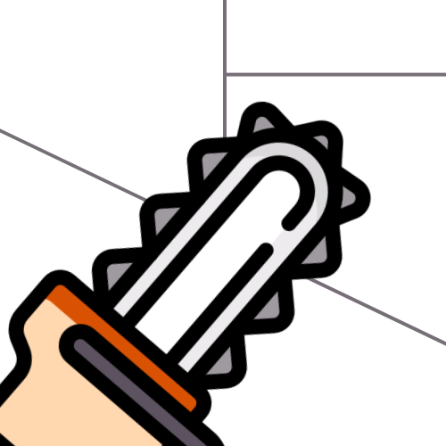

# Changesaw - The Astro plugin for changelogs

Changesaw is an Astro plugin which allows you to create changelogs from your astro site's [content collections](https://docs.astro.build/en/guides/content-collections/).

### Documentation 📄

### Roadmap 🛣️

This plugin was created to explore [Astro's integrations API](https://docs.astro.build/en/reference/integrations-reference/), I also planned to use it for a project, that has been halted now, however I still plan to add features to this plugin over time. This is what is on my list:

- [x] API endpoint
- [ ] Dark mode
- [ ] Studio
- [ ] Github action
- [ ] Social sharing
- [x] Custom styling
- [x] Code block styling 
- [ ] Tailwind
- [ ] Internationalization
- [ ] View transitions
- [ ] Dynamic OG images
